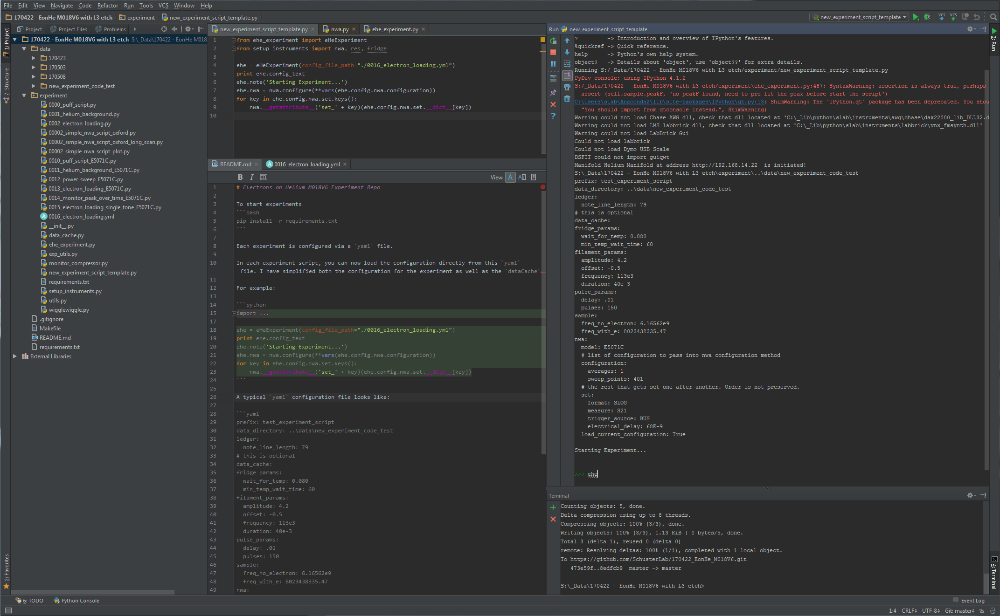

# Electrons on Helium M018V6 Experiment Repo

link: https://github.com/SchusterLab/170422_EonHe_M018V6#electrons-on-helium-m018v6-experiment-repo

To start experiments
```bash
pip install -r requirements.txt
```

Each experiment is configured via a `yaml` file.

In each experiment script, you can now load the configuration directly from this `yaml` file. I have simplified both the configuration for the experiment as well as the `dataCache`.
 
For example: 

```python
from ehe_experiment import eHeExperiment
from setup_instruments import nwa, res, fridge

ehe = eHeExperiment(config_file_path="./0016_electron_loading.yml")
print ehe.config_text
ehe.note('Starting Experiment...')
ehe.nwa = nwa.configure(**vars(ehe.config.nwa.configuration))
for key in ehe.config.nwa.set.keys():
    nwa.__getattribute__('set_' + key)(ehe.config.nwa.set.__dict__[key])
```

A typical `yaml` configuration file looks like:

```yaml
prefix: test_experiment_script
data_directory: ..\data\new_experiment_code_test
ledger:
  note_line_length: 79
# this is optional
data_cache:
fridge_params:
  wait_for_temp: 0.080
  min_temp_wait_time: 60
filament_params:
  amplitude: 4.2
  offset: -0.5
  frequency: 113e3
  duration: 40e-3
pulse_params:
  delay: .01
  pulses: 150
sample:
  freq_no_electron: 6.16562e9
  freq_with_e: 8023438335.47
nwa:
  model: E5071C
  # list of configuration to pass into nwa configuration method
  configuration:
    averages: 1
    sweep_points: 401
  # the rest that gets set one after another. Order is not preserved.
  set:
    format: SLOG
    measure: S21
    trigger_source: BUS
    electrical_delay: 68E-9
  load_current_configuration: True

```

The work enviroment would look like this:



Authors:
- Ge Yang: yangge1987@gmail.com
- Gerwin Koolstra

University of Chicago